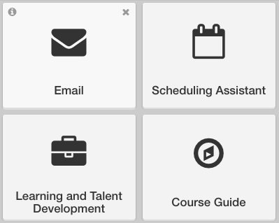

Compact mode is a minimalist interface for MyUW. This mode works well on small screens and for users who want to see many widgets at once.

Compact widgets have:

+ Info icon (displayed on hover): Shows the description for the app behind the widget
+ Delete icon (displayed on hover): Removes the widget from the user's layout
+ App icon: A large icon that represents the app
+ Title: The title of the application (e.g. Email)
