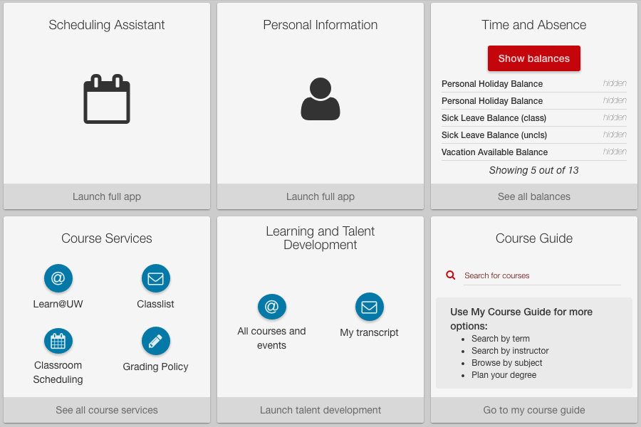

Expanded mode (also referred to as widget mode) is a new method of displaying important content to users about your application. Use it to display 
the most important information, which can be user specific.

There are a number of different [widget types](#/md/widgets) pictured in the image above, but all of them contain the following features/information:
* Configurable title text
* Configurable launch text
* Info icon (displayed on hover): Shows the app description of the selected widget
* Delete icon (displayed on hover): Removed the widget from the user's layout

### uw-frame styles
Some of the CSS styles for widgets are located in the uw-frame project. You can read about those styles in frame's [widget.less file on Github](https://github.com/UW-Madison-DoIT/uw-frame/blob/master/uw-frame-components/css/buckyless/widget.less).