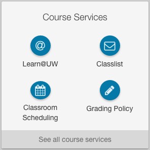
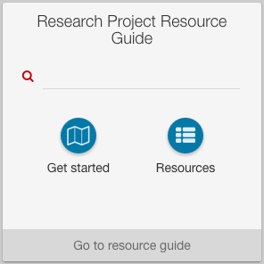

 
## Widget types

The following widget types are available and one of the should (hopefully) meet your needs. They are all intended to 
save developers the time and effort required to make a custom widget.

#### How to use

Follow these steps for each of the widget types described in this doc: 
 
1. Follow the "when to use" guidance to select the widget type that will best suit your needs
2. Add the appropriate `widgetType` value to your app's entity file (see widget type's sample code)
3. Add a `widgetConfig` to your app's entity file (see widget type's sample code)


### List of links



```
<name>widgetType</name>
<value>list-of-links</value>
```

#### When to use

* You only need your widget to display a list of 2-7 links

#### Sample entity file

```html
<portlet-preference>
	<name>widgetType</name>
	<value>list-of-links</value>
</portlet-preference>
<portlet-preference>
	<name>widgetConfig</name>
    <value>
    	<![CDATA[{
      		"launchText":"Launch talent development",
      		"links": [
      			{
          			"title":"All courses and events",
          			"href":"https://www.ohrd.wisc.edu/home/",
          			icon":"fa-at",
          			"target":"_blank"
        		},
        		{
          			"title":"My transcript",
          			"href":"https://www.ohrd.wisc.edu/ohrdcatalogportal/LearningTranscript/tabid/57/Default.aspx?ctl=login",
          			"icon":"fa-envelope-o",
          			"target":"_blank"
          		}
      		]
      	}]]>
	</value>
</portlet-preference>

```

#### Additional information

* `launchText` is optional. Omitting `launchText` suppresses the launch button at the bottom of the list-of-links widget. This is appropriate 
when there's nothing more to launch, that is, when the list-of-links widget simply presents all the intended links and that's all there is to it.
* Avoid using a `list-of-links` widget when you only need to display one link. Instead, use the name and `alternativeMaximizedLink` of [the app directory entry](#/md/app-directory) to represent the link. 
This provides a more usable click surface, a simpler and cleaner user experience, and achieves better consistency with other just-a-link widgets in MyUW.
* The length of your list of links will affect the widget's appearance. If you have more than 4 links, they will be displayed in a more traditional-style list, rather than with the `<circle-button>` directive.

### Search with links



```
<name>widgetType</name>
<value>search-with-links</value>
```

#### When to use

* Your app has built-in search
* (optional) and you want to display up to 2 links

#### Sample entity file

```html
<portlet-preference>
	<name>widgetType</name>
	<value>search-with-links</value>
</portlet-preference>
<portlet-preference>
	<name>widgetConfig</name>
	<value>
		<![CDATA[{
			"actionURL":"https://rprg.wisc.edu/search/",
			"actionTarget":"_blank",
			"actionParameter":"q",
			"launchText":"Go to resource guide",
			"links":[
				{
					"title":"Get started",
					"href":"https://rprg.wisc.edu/phases/initiate/",
					"icon":"fa-map-o",
					"target":"_blank"
                },
                {
                	"title":"Resources",
                    "href":"https://rprg.wisc.edu/category/resource/",
                    "icon":"fa-th-list",
                    "target":"_blank"
              	}
             ]
        }]]>
	</value>
</portlet-preference>
```

### RSS widget


```
<name>widgetType</name>
<value>rss</value>
```

#### When to use

* You want to display an RSS feed right on your MyUW home page

#### Sample entity file
```html
<portlet-preference>
    <name>widgetType</name>
    <value>rss</value>
</portlet-preference>
<portlet-preference>
    <name>widgetURL</name>
    <value>http://www.ncaa.com/news/ncaa/d1/rss.xml</value>
</portlet-preference>
<portlet-preference>
    <name>widgetConfig</name>
    <value>
    	<![CDATA[{
    		"lim": 4,
    		"showdate": true,
    		"dateFormat": "MM-dd-yyyy",
    		"showShowing": true
    	}]]>
    </value>
</portlet-preference>
```

#### Additional information

Note the addition required value in the entity file:
* `widgetUrl`: The URL of the rss feed you want to display

### Custom widgets
Using a JSON service is a great way to have user-focused content in your widgets. Here are the steps you have to take to create your custom JSON-backed widget:

#### 1. widgetURL
This is where we will get the data from (in a JSON format). If your JSON feed lives outside of the portal, you will need to setup 
a rest proxy for that. Please contact the MyUW team for details and assistance.

```html
<portlet-preference>
  <name>widgetURL</name>
  <value>/portal/p/earnings-statement/max/earningStatements.resource.uP</value>
</portlet-preference>
```

When your widget is rendered, this service is called via a `GET`. The returned content is stored in the scope variable `content`.

#### 2. widgetType
Setting this to `generic` will enable you to provide your own template. Be sure to evaluate the out of the box widget types 
before creating your own (documentation on those above).

```html
<portlet-preference>
    <name>widgetType</name>
    <value>generic</value>
</portlet-preference>
```

#### 3. widgetTemplate
This is where the template goes. We suggest using a CDATA tag here.
```html
<portlet-preference>
        <name>widgetTemplate</name>
        <value>
        	<![CDATA[
				<div style='margin : 0 10px 0 10px;'>
				   <loading-gif data-object='content' data-empty='isEmpty'></loading-gif>
				   <ul class='widget-list'><li ng-repeat=\"item in content.report |orderBy: ['-paid.substring(6)','-paid.substring(0,2)','-paid.substring(3,5)'] | limitTo:3\" class='center'><a href='/portal/p/earnings-statement/max/earning_statement.pdf.resource.uP?pP_docId={{item.docId}}' target='_blank'><i class='fa fa-bank fa-fw'></i> {{item.paid}} Statement</a></li></ul>
				   <div ng-if='isEmpty' style='padding: 10px; font-size: 14px;'><i class='fa fa-exclamation-triangle fa-3x pull-left' style='color: #b70101;'></i><span style='color: #898989;'>We had a problem finding your statements (or you don't have any).</span></div>
				   <div style='background-color: #EAEAEA; border-radius:4px;padding:10px; margin-top:10px;'>
					  <span class='bold display-block left' style='text-align: left; padding-left: 10px; font-size: 14px;'>See all payroll information for more options:</span>
					  <ul style='text-align: left;list-style-type: disc; font-size: 12px;'>
						 <li>See all pay stubs</li>
						 <li>Tax statements</li>
						 <li>Update direct deposit</li>
					  </ul>
				   </div>
				</div>
				<a class='btn btn-default launch-app-button' href='/portal/p/earnings-statement'>See all payroll information</a>
        	]]>
        </value>
</portlet-preference>
```

#### 4. widgetConfig

The widget config is a JSON object. Please note it has to be valid JSON. We used the <![CDATA[]]> tag so we didn't have to encode everything.

Currently we only use the evalString to evaluate emptiness. We may add more in the future.

```html
<portlet-preference>
    <name>widgetConfig</name>
    <value><![CDATA[{ "evalString" : "!$scope.content.report || $scope.content.report.length === 0"}]]></value>
</portlet-preference>
```

By doing just this we were able to generate:


## Other Configuration

If you provide a `widgetConfig` with any widget type with a value for `launchText`, it will replace the text of the 
launch button with the provided value, even for non-widgets.

Example:

```html
<portlet-preference>
    <name>widgetConfig</name>
    <value>
    	<![CDATA[{
      		'launchText' : 'See all the Weather'
    	}]]>
    </value>
</portlet-preference>
```

Read more about the [launch button text guidance](#/md/widget-launch-button).


